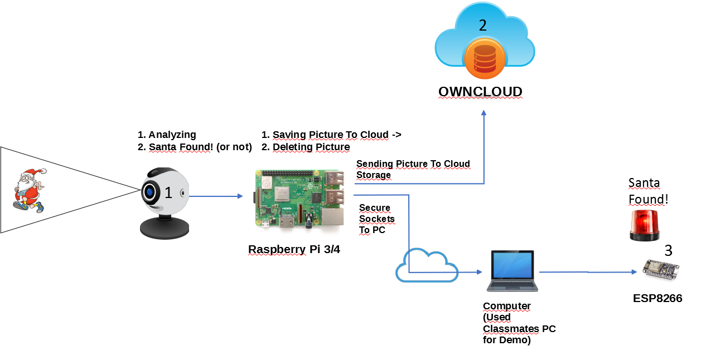

# Project-Finding-Santa
A Machine Learning project made to recognize santa from live USB feed. 

When it finds santa it sends out an alarm.

For this i had:
- Raspberry Pi:
    - Running a live feed from a webcam
    - Using ML to detect if 'santa' appeared
    - If santa gets spotted, capture the frame and upload it to own running cloud server.
    - Run the alarm.

- Python server:
    - Held a secure connection with crt.
    - Hit on an URL for the ESP8266 to toggle the alarm - keeping delay at minimal.

- ESP8266:
  - A Webserver that just toggled a light if we got a GET request.

This requires OpenCV to be installed and a USB camera that is connected to the device running the python script.

Included below is a picture of the structure.

Me with a picture of santa. 

